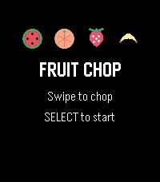
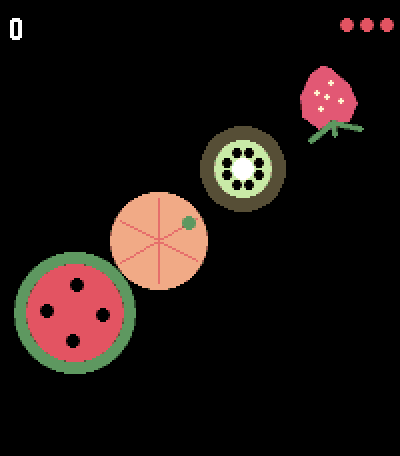

# Fruit Chop

A Fruit Ninja-style game for Pebble Time 2 and Pebble Round 2.

<p align="center">
  
  &nbsp;&nbsp;
  
</p>


Download it from [Pebble App Store](https://apps.repebble.com/82fc69b2d0964fe28e2520c3)

Sixteen fruits arc up from the bottom of the screen — watermelon, mango,
pineapple, coconut, strawberry, green and red apple, kiwifruit, banana, lemon,
lime, orange, plum, pear, passion fruit and peach — each with its own colour,
silhouette and size. Swipe across the touchscreen to slice them.

Every fruit splits along the exact line of your swipe and keeps its own shape
doing it: cut a banana and you get two pieces of banana, not two half-circles.
Each cut opens a rind, shows the flesh underneath, and throws a burst of juice
in that fruit's colour. One swipe can take several fruits at once, which is
where the scores are.

Slice a bomb and the run ends on the spot. Drop three fruits and it is over too.

Everything is drawn procedurally on the watch — no image resources — so the app
is a few kilobytes and the fruit stays sharp at any size. There is no phone
component: no PebbleKit JS, no companion app, no network.

## Difficulty

Pick a setting on the title screen with UP and DOWN. It changes how much fruit
arrives at once, how often it arrives, and how much of it is a bomb:

| | Fruit per wave | Bombs | On screen at once |
| --- | --- | --- | --- |
| Easy | 1 | rare | ~1–2 |
| Normal | 1–2 | some | ~3–5 |
| Hard | 2–3 | frequent | ~5–10 |

A wave never contains more than one bomb, so there is always a safe stroke
through a group. Your best score is kept separately for each difficulty and
shown under the title.

## Requirements

Touch input exists only on the modern Pebble hardware, so the game targets:

- **emery** — Pebble Time 2, 200x228 colour
- **gabbro** — Pebble Round 2, 260x260 colour

Built with Pebble SDK 4.17 (`touch_service_subscribe` requires SDK 4.9+).

## Building

```bash
cd watch
pebble build
pebble install --emulator emery      # or gabbro, or --phone <ip>
```

## Playing

| Input | Action |
| --- | --- |
| Swipe | Slice fruit |
| Tap (title) | Start |
| SELECT | Start / retry |
| UP / DOWN (title) | Easier / harder |
| BACK | Return to title, or exit from the title |

During play the buttons do nothing — slicing is touch only. Development builds
can remap them to scripted swipes for testing; see `CLAUDE.md`.

## Layout

```
watch/               the game (all pebble commands run from here)
  src/c/
    fc_config.h      every tunable: physics, spawning, pools, juice
    fruit.c/.h       the roster: one profile row per fruit
    game.c/.h        simulation, difficulty, scores (no drawing)
    draw.c/.h        procedural rendering and screens
    blade.c/.h       touch buffer and trail
    main.c           window lifecycle, loop, input
developer-portal/    app-store assets: banner, icons, screenshots, description
```

See `CLAUDE.md` for the architecture notes and the accumulated gotchas — display
colour collisions, the slice geometry, and the emulator faults worth knowing
before changing anything.
